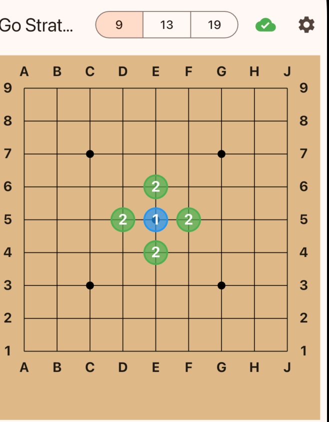
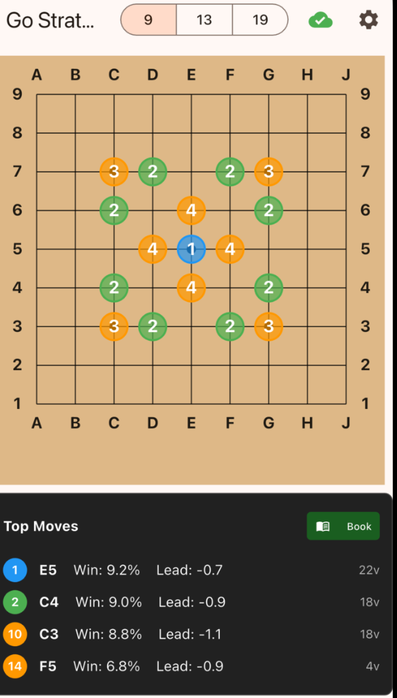

# Go Strategy App - UI Specification

> **Goal**: Ensure a consistent, high-quality user experience across Mobile (Flutter) and Web (Streamlit/React) platforms.

## 1. Visual Design Standards

### 1.1 Suggestion Ranking & Coloring
AI suggestions are grouped into **3 Tiers** based on Winrate and Score Lead. This "Dense Ranking" logic (1, 2, 3) must be consistent visually.

| Rank | Tier Name | Color Logic | Hex Code (Ref) |
|------|-----------|-------------|----------------|
| **1** | **Best** | Primary Action | `Colors.blue` / `#2196F3` |
| **2** | **Good** | Safe/Solid | `Colors.green` / `#4CAF50` |
| **3** | **OK** | Warning/Alternative | `Colors.orange` / `#FF9800` |

**Visual Reference:**

  
   
  <em>Moves are clearly numbered 1, 2, 3 with corresponding colors. Unsuitable moves are hidden.</em>

### 1.2 Board Aesthetics
- **Background**: Wooden Texture or CSS Color `#DEB887` (Burlywood).
- **Stones**: 
  - **Black**: `#000000` with slight radial gradient (grey highlight).
  - **White**: `#FFFFFF` with grey border stroke `1px`.
- **Shadows**: Soft drop shadow (offset 2px, blurred) under stones for depth.
- **Move Numbers**: Auto-contrasting numbers (White on Black, Black on White) centered on stones. Default to **OFF**, toggleable standard.

---

## 2. Analysis Interface

### 2.1 Sidebar Information
The analysis panel (or Sidebar on desktop) must display the top suggestions synchronized with the board.

**Requirements:**
- **List Items**: Must show Rank (Circle Icon), Move Coordinate (e.g., "Q16"), Winrate %, and Score Lead.
- **Consistency**: The Rank Number in the list **must match** the Rank Number on the board (Dense Rank 1-2-3).
- **Actions**: Clicking a list item should highlight or preview the move on the board.

**Visual Reference:**

  
   
  <em>Top moves list showing Winrate, Lead, and Visit counts.</em>

### 2.2 History Record (Kifu)
- A dedicated tab/section for "Move History".
- Format: `Move N: [Color] [Coordinate]` (e.g., "Move 52: White D10").
- Navigation: Tapping a history item should jump the board state to that move (Undo/Redo logic).

---

## 3. Interaction Design

### 3.1 Input Handling
- **Tap**: Place stone (Ghost stone on hover for Desktop).
- **Invalid Moves**:
  - **Ko**: Shake animation or Toast message "Ko rule violation".
  - **Suicide**: Toast message "Suicide is forbidden".
- **Turn structure**: Black -> White -> Black... (Handicap aware).

### 3.2 Analysis States
| State | Visual Indicator | Message |
|-------|------------------|---------|
| **Idle** | None | "Tap to analyze" |
| **Loading** | Spinner / Progress Bar | "Analyzing... (N/M visits)" |
| **Complete** | Results List | Top moves displayed |
| **Error** | Red Badge / Banner | Error description text |

---

## 4. Platform Specifics Checklist

- [x] **Mobile (Flutter)**: 
  - Bottom-sheet settings.
  - Tabbed Analysis Panel (Analysis / History).
  - Touch-optimized sizing (min 44px tap targets).
- [ ] **Web (Streamlit/React)**:
  - Sidebar layout.
  - Keyboard shortcuts (Left/Right arrows for history).
  - Hover effects on intersections.

*This specification is a living document. Update screenshots when UI components are polished.*
