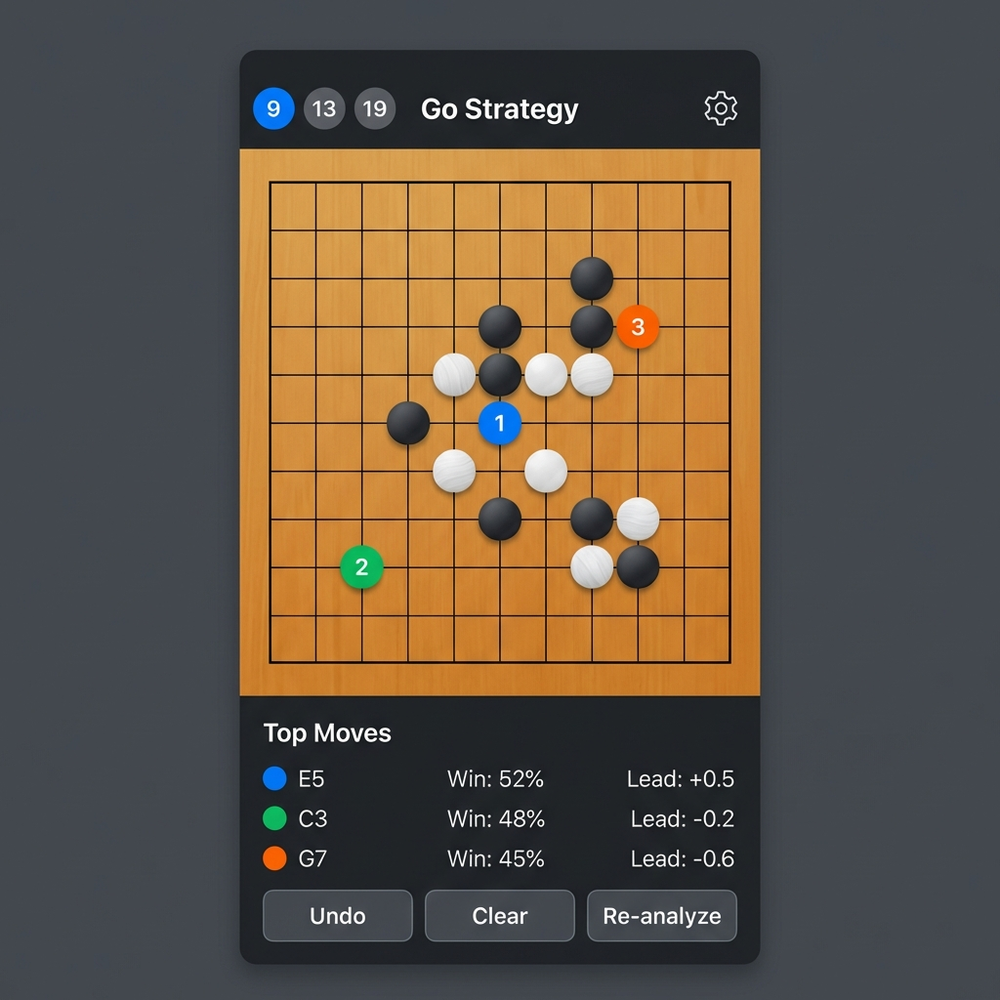

# 📖 Go Strategy App 使用說明書

**適用對象:** App 使用者（圍棋愛好者）  
**版本:** 1.0  
**最後更新:** 2026-01-28

---

## 目錄

1. [App 簡介](#app-簡介)
2. [快速開始](#快速開始)
3. [介面說明](#介面說明)
4. [基本操作](#基本操作)
5. [AI 分析功能](#ai-分析功能)
6. [設定選項](#設定選項)
7. [常見問題](#常見問題)

---

## App 簡介

**Go Strategy App** 是一款由世界級 AI「KataGo」驅動的圍棋分析工具。無論你是初學者還是業餘高手，都能透過這款 App 獲得專業的落子建議，提升棋力。

### ✨ 主要特色

- 🎯 **AI 推薦棋步** - 顯示前三名最佳落子位置
- 📊 **勝率分析** - 即時顯示每一手的勝率變化
- 📱 **離線使用** - 內建開局庫，不需網路也能分析
- 🔢 **多種棋盤** - 支援 9x9、13x13、19x19 路棋盤

---

## 快速開始

### 第一次使用？跟著這 3 步驟：

```
1️⃣ 開啟 App
   ↓
2️⃣ 點擊棋盤上的任意位置落子
   ↓
3️⃣ 等待 AI 分析，查看推薦棋步！
```

就是這麼簡單！

---

## 介面說明

App 的畫面分為三個主要區域：



**畫面結構圖 (ASCII 版)：**
```
┌─────────────────────────────────────────┐
│  📌 頂部工具列                            │
│  ┌─────────────────────────────────────┐ │
│  │ Go Strategy    [9][13][19]    ⚙️   │ │
│  └─────────────────────────────────────┘ │
├─────────────────────────────────────────┤
│                                         │
│           🎮 棋盤區域                    │
│                                         │
│    ┌─┬─┬─┬─┬─┬─┬─┬─┬─┐                  │
│    ├─┼─┼─┼─┼─┼─●─┼─┤                   │
│    ├─┼─┼─○─┼─┼─┼─┼─┤                   │
│    ├─┼─┼─┼─①─┼─┼─┼─┤  ← AI 推薦標記    │
│    ├─┼─┼─┼─┼─②─┼─┼─┤                   │
│    └─┴─┴─┴─┴─┴─┴─┴─┴─┘                  │
│                                         │
├─────────────────────────────────────────┤
│  📊 分析面板                             │
│  ┌─────────────────────────────────────┐ │
│  │ Top Moves        [分析來源: Book]   │ │
│  │ 🔵 1. E5   Win: 52%  Lead: +0.5    │ │
│  │ 🟢 2. D4   Win: 51%  Lead: +0.3    │ │
│  │ 🟠 3. F6   Win: 50%  Lead: +0.1    │ │
│  └─────────────────────────────────────┘ │
├─────────────────────────────────────────┤
│  🎛 控制按鈕                             │
│  [ ⬅️ Undo ]  [ 🗑 Clear ]  [ 🔄 Re-analyze ] │
└─────────────────────────────────────────┘
```

---

## 基本操作

### 🖐 落子

**方法：** 直接點擊棋盤上的空白交叉點

- 黑棋與白棋會**自動輪流**
- 如果點擊的位置是違規的（如禁著點），落子會被拒絕
- 每次落子後，AI 會自動開始分析

### ⬅️ 悔棋 (Undo)

**方法：** 點擊底部的「Undo」按鈕

- 每次點擊會撤銷一手棋
- 可以連續撤銷多手

### 🗑 清空棋盤 (Clear)

**方法：** 點擊「Clear」按鈕

- 將棋盤恢復到空白狀態
- 會清除所有落子紀錄

### 🔄 重新分析 (Re-analyze)

**方法：** 點擊「Re-analyze」按鈕

- 強制 AI 重新計算當前局面
- 通常用於想獲得更深入的分析時

---

## AI 分析功能

### 🔢 讀懂 AI 建議

AI 會在棋盤上標示**前三名推薦棋步**，並用顏色區分：

| 顏色 | 排名 | 意義 |
|------|------|------|
| 🔵 藍色 | 第 1 名 | **最佳棋步** |
| 🟢 綠色 | 第 2 名 | 好棋 |
| 🟠 橘色 | 第 3 名 | 可接受的棋 |

### 📊 分析數據說明

| 數據 | 意義 | 範例 |
|------|------|------|
| **Win** | 勝率（你下這步後的預估勝率） | `52%` |
| **Lead** | 領先目數（正數=領先，負數=落後） | `+1.5` |
| **v** | 訪問數（AI 思考的深度，越高越準確） | `150v` |

### 📦 分析來源

分析結果旁邊會顯示資料來源：

| 標籤 | 說明 |
|------|------|
| **Book** | 來自內建開局庫（最快） |
| **Cache** | 來自本地快取（快） |
| **Local** | 裝置上的 KataGo 即時計算（中速） |
| **Live** | 來自線上 API（需網路） |

---

## 設定選項

點擊右上角的 **⚙️ 齒輪圖示** 開啟設定：

### 棋盤大小

- **9x9** - 適合快速對局、練習死活
- **13x13** - 中等難度
- **19x19** - 正式比賽規格

### Lookup Visits (查詢門檻)

設定從開局庫/快取讀取資料的**最低訪問數門檻**。

- 數值越高，只會採用更深入分析過的資料
- 建議值：**100**（平衡速度與準確度）

### Compute Visits (計算強度)

設定本地 AI 即時計算時使用的**訪問數**。

- 數值越高，分析越準確但越慢
- 建議值：**50**（適合手機）

### 貼目 (Komi)

設定白棋的補償分數。

- 一般對局使用 **7.5**
- 讓子棋通常設為 **0.5**

### 顯示手數

開啟後，棋子上會顯示落子順序的數字。

---

## 常見問題

### Q: 為什麼 AI 說我下的棋「只有 48% 勝率」？

**A:** 這是正常的！由於貼目 (Komi) 的關係，白棋有 7.5 目的補償，所以黑棋在開局時通常只有 48-49% 的勝率。這不代表你下錯了。

### Q: AI 分析很慢怎麼辦？

**A:** 可以：
1. 降低「Compute Visits」設定（例如降到 30）
2. 使用較小的棋盤（9x9 比 19x19 快很多）
3. 確保使用的是較新款的裝置

### Q: 可以離線使用嗎？

**A:** 可以！App 內建開局庫，涵蓋了數萬個常見局面。即使沒有網路，也能獲得基本的 AI 建議。若局面不在開局庫中，App 也會在裝置上進行即時計算。

### Q: 我可以儲存棋譜嗎？

**A:** 棋譜儲存功能正在開發中，敬請期待！

### Q: 這個 App 支援哪些平台？

**A:** 
- ✅ iOS (iPhone, iPad)
- ✅ Android
- ✅ macOS
- ✅ Windows
- ✅ 網頁版

---

## 🆘 需要幫助？

如果你遇到問題或有建議，歡迎透過以下方式聯繫：

- **GitHub Issues:** [github.com/justmaker/go-strategy-app/issues](https://github.com/justmaker/go-strategy-app/issues)

---

**祝你棋力進步！🎯**
