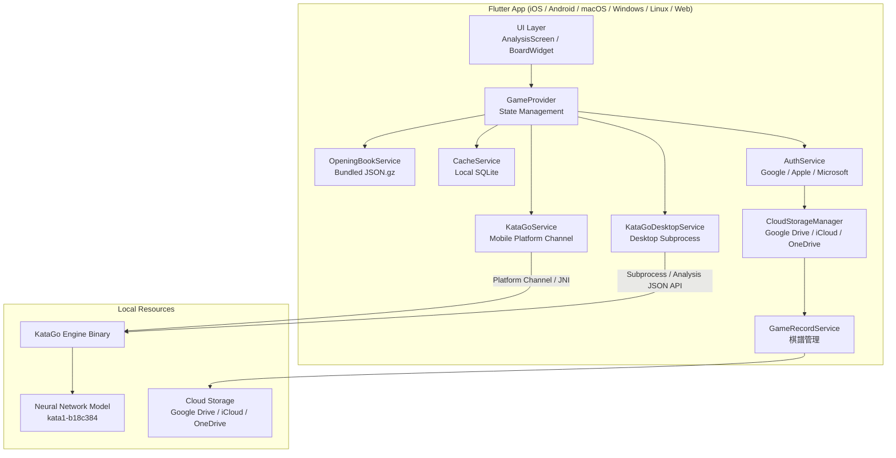
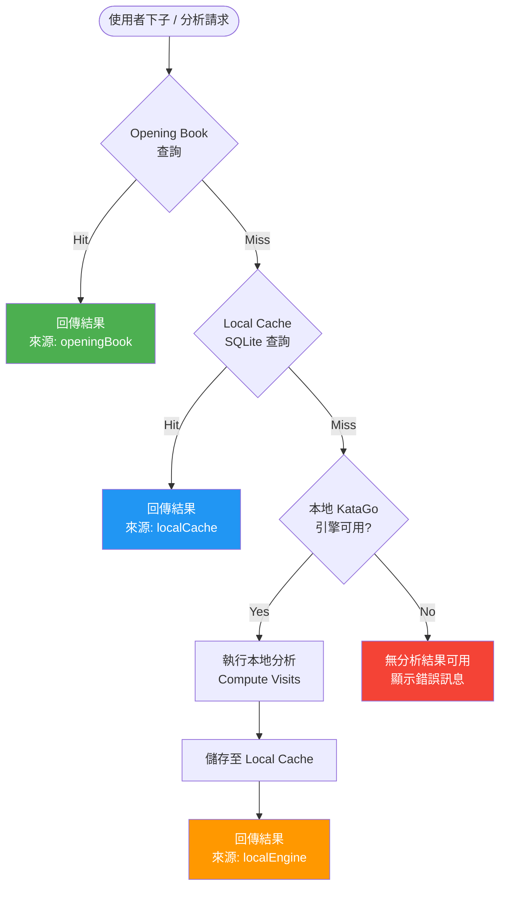
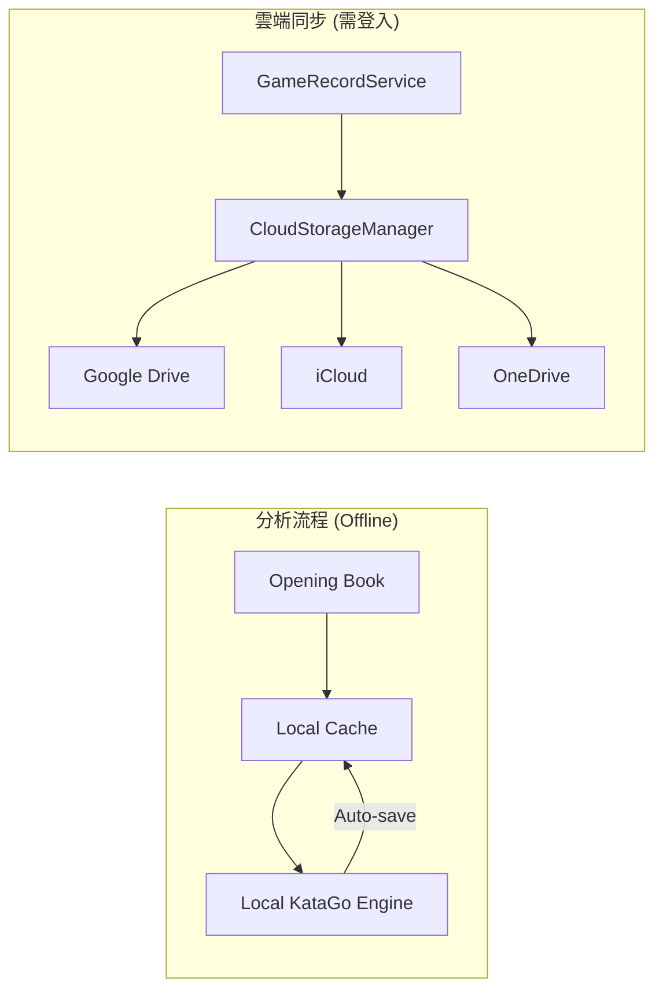

# Architecture Specification

**Version**: 1.1
**Last Updated**: 2026-02-12

## 1. 系統概述 (System Overview)

Go Strategy App 是一個基於 KataGo AI 的圍棋策略分析工具，採用 **純離線 (Offline-Only)** 架構設計。系統為 Flutter 跨平台 App，內建 Opening Book、本地 SQLite 快取與本地 KataGo 引擎，所有分析功能在完全離線狀態下運作，不依賴任何遠端伺服器。

> **注意**：專案中保留了 Python Backend 程式碼（`src/`）作為資料生成工具（Opening Book 建置、KataGo Book 匯入等），但 **不作為 App 的運行時依賴**。

---

## 2. 元件總覽圖 (Component Diagram)



---

## 3. 元件職責說明 (Component Responsibilities)

| 元件 | 檔案 | 職責 |
|------|------|------|
| **GameProvider** | `mobile/lib/providers/game_provider.dart` | 核心狀態管理，實作離線查詢流程 (Opening Book → Cache → Local Engine)，管理棋盤狀態、分析結果、雙滑桿設定 |
| **OpeningBookService** | `mobile/lib/services/opening_book_service.dart` | 載入並查詢隨 App 打包的 `opening_book.json.gz`，支援 8 種對稱變換查詢，提供即時離線分析 |
| **CacheService** | `mobile/lib/services/cache_service.dart` | 本地 SQLite 快取管理，支援智慧合併邏輯 (completeness → effort → recency) |
| **KataGoService** | `mobile/lib/services/katago_service.dart` | 行動裝置本地引擎，透過 Platform Channel (Android JNI / iOS FFI) 與原生 KataGo 通訊，支援串流進度回報 |
| **KataGoDesktopService** | `mobile/lib/services/katago_desktop_service.dart` | 桌面平台本地引擎，透過 `dart:io Process` 啟動 KataGo Analysis JSON API 子進程，支援即時進度串流 |
| **AuthService** | `mobile/lib/services/auth_service.dart` | 多提供者認證 (Google / Apple / Microsoft / Anonymous)，使用者可匿名使用但雲端同步需登入 |
| **CloudStorageManager** | `mobile/lib/services/cloud_storage_service.dart` | 統一雲端儲存介面，支援 Google Drive / iCloud / OneDrive 棋譜同步 |
| **GameRecordService** | `mobile/lib/services/game_record_service.dart` | 棋譜管理，結合本地儲存與雲端同步 |

### Python 工具（非運行時元件）

`src/` 目錄下的 Python 程式碼用於**資料生成與管理**，不參與 App 運行：

| 工具 | 檔案 | 用途 |
|------|------|------|
| **build_opening_book.py** | `src/scripts/build_opening_book.py` | BFS 建置 Opening Book，呼叫 KataGo 運算 |
| **import_katago_book.py** | `src/scripts/import_katago_book.py` | 匯入 KataGo 官方 book 到 SQLite |
| **export_opening_book.py** | `src/scripts/export_opening_book.py` | 從 SQLite 匯出 JSON 給 App 使用 |
| **BoardState** | `src/board.py` | Zobrist Hash、D4 對稱變換、GTP 座標轉換 |
| **AnalysisCache** | `src/cache.py` | SQLite 資料管理、Schema 遷移 |

---

## 4. 三層查詢流程 (Three-Layer Query Flow)

App 採用三層級聯查詢，確保離線運作且回應快速：



### 各層說明

| 層級 | 資料來源 | 延遲 | 需要網路 | 需要 GPU |
|------|---------|------|---------|---------|
| **Layer 1: Opening Book** | `opening_book.json.gz` (隨 App 打包) | < 1ms | No | No |
| **Layer 2: Local Cache** | `analysis_cache.db` (本地 SQLite) | < 10ms | No | No |
| **Layer 3: Local Engine** | KataGo 本地引擎 | 1-120s (依 visits) | No | Yes (CPU/GPU) |

---

## 5. 資料流 (Data Flow)



### 分析流程
- 完全不需網路連線
- Opening Book 提供常見定式的高品質分析 (500+ visits)
- Local Cache 儲存歷史分析結果
- Local KataGo Engine 處理未快取的局面，結果自動存入 Cache

### 雲端同步
- 獨立於分析流程，僅用於棋譜同步
- 需要使用者登入 (Google / Apple / Microsoft)
- 棋譜存於使用者自己的雲端空間

---

## 6. 通訊協定 (Communication Protocols)

### 6.1 Flutter Desktop <-> KataGo: Analysis JSON API

- 透過 `dart:io Process.start()` 建立子進程
- KataGo 以 `analysis` 模式啟動 (非 GTP 模式)
- 透過 stdin 發送 JSON 查詢，stdout 接收 JSON 回應
- 支援 `reportDuringSearchEvery` 串流進度回報

### 6.2 Flutter Mobile <-> KataGo: Platform Channel

- Android: 透過 MethodChannel 呼叫 JNI 原生 KataGo
- iOS: 透過 MethodChannel 呼叫 FFI 原生 KataGo
- EventChannel 用於串流分析進度 (visits, winrate, scoreLead)

---

## 7. 部署拓撲 (Deployment Topology)

```
┌─────────────────────────────────┐
│  Flutter App                     │
│  ┌───────────┐ ┌──────────────┐ │
│  │ Opening   │ │ Local SQLite │ │
│  │ Book .gz  │ │ Cache        │ │
│  └───────────┘ └──────────────┘ │
│  ┌───────────────────────────┐  │
│  │ Local KataGo Engine       │  │
│  │ (Platform Channel / Proc) │  │
│  └───────────────────────────┘  │
└─────────────────────────────────┘
```

- 完全離線運作，無伺服器依賴
- Opening Book (~31K 筆) + Local Cache 覆蓋常見局面
- Local KataGo 處理新局面 (受限於裝置算力)
- Web 平台無本地引擎，僅依賴 Opening Book

---

## 8. 技術堆疊 (Technology Stack)

| 類別 | 技術 | 用途 |
|------|------|------|
| **Frontend Framework** | Flutter 3.x (Dart) | 跨平台 UI (iOS / Android / macOS / Windows / Linux / Web) |
| **State Management** | Provider + ChangeNotifier | App 狀態管理 |
| **Local Database** | SQLite (sqflite / sqflite_common_ffi) | 本地分析快取 |
| **AI Engine** | KataGo | 圍棋 AI 分析引擎 |
| **AI Model** | kata1-b18c384nbt | 18-block 384-channel 神經網路 |
| **Communication** | Analysis JSON API / Platform Channel | KataGo 通訊 |
| **Authentication** | Google Sign-In / Apple Sign-In | 多提供者登入 |
| **Cloud Storage** | Google Drive / iCloud / OneDrive | 棋譜雲端同步 |
| **Serialization** | JSON / gzip | 資料交換與壓縮 |
| **Hashing** | Zobrist Hash (64-bit) | 棋盤局面唯一識別 |
| **Symmetry** | D4 Dihedral Group (8 transforms) | 8 倍快取效率 |
| **Data Tools** | Python (scripts) | Opening Book 建置與資料管理 |

---

## 9. 關鍵設計決策 (Key Design Decisions)

### 9.1 純離線架構 (Offline-Only)
所有分析功能在無網路狀態下運作。Opening Book 隨 App 打包，Local Cache 與 Local Engine 提供完整離線體驗。不依賴任何遠端 API Server，避免伺服器維運成本。

### 9.2 對稱感知快取 (Symmetry-Aware Caching)
利用圍棋棋盤的 D4 對稱群 (4 旋轉 x 2 翻轉 = 8 種變換)，將所有等價局面映射至同一 Canonical State，使快取效率提升 8 倍。查詢時自動進行反向變換，對使用者完全透明。

### 9.3 雙滑桿控制 (Dual-Slider System)
- **Lookup Visits** (100-5000): 控制快取查詢門檻，決定「什麼品質的快取可接受」
- **Compute Visits** (10-200): 控制本地引擎運算強度，平衡分析品質與裝置耗能

### 9.4 平台自適應引擎 (Platform-Adaptive Engine)
- Desktop (macOS/Windows/Linux): 透過 `dart:io Process` 啟動 KataGo Analysis JSON API
- Mobile (Android): 透過 JNI Platform Channel 呼叫原生 KataGo 庫
- Mobile (iOS): 透過 FFI Platform Channel 呼叫原生 KataGo 庫
- Web: 不支援本地引擎，僅依賴 Opening Book
