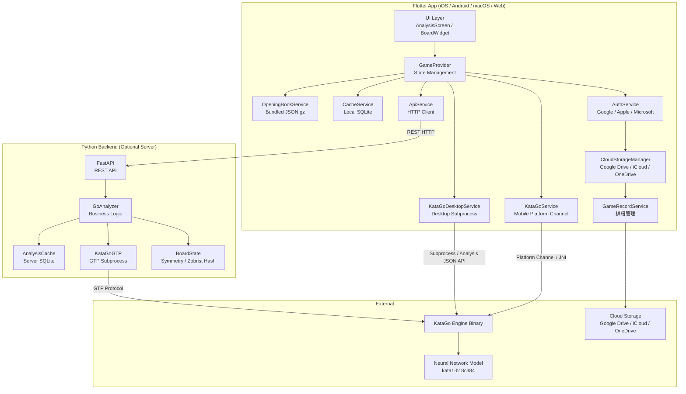
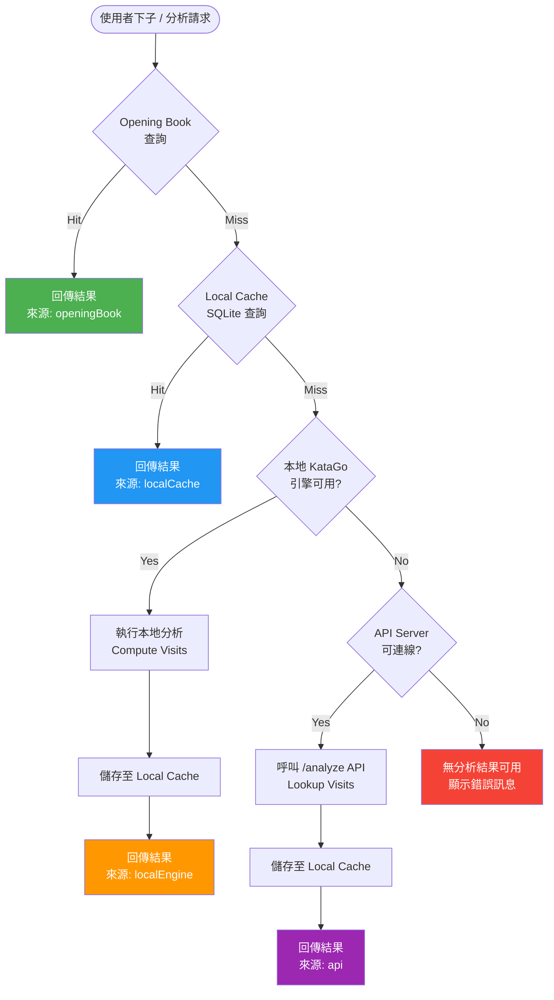
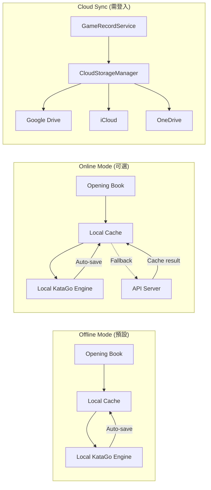

# Architecture Specification

**Version**: 1.0
**Last Updated**: 2026-02-12

## 1. 系統概述 (System Overview)

Go Strategy App 是一個基於 KataGo AI 的圍棋策略分析工具，採用 **離線優先 (Offline-First)** 架構設計。系統由 Flutter 跨平台前端與 Python FastAPI 後端組成，前端內建 Opening Book、本地 SQLite 快取與本地 KataGo 引擎，可在完全離線狀態下提供分析服務。後端作為可選的伺服器端分析服務，提供高算力 KataGo 分析與集中式快取。

---

## 2. 元件總覽圖 (Component Diagram)



---

## 3. 元件職責說明 (Component Responsibilities)

### 3.1 Flutter App 端

| 元件 | 檔案 | 職責 |
|------|------|------|
| **GameProvider** | `mobile/lib/providers/game_provider.dart` | 核心狀態管理，實作離線優先查詢流程 (Opening Book → Cache → Local Engine → API)，管理棋盤狀態、分析結果、雙滑桿設定 |
| **OpeningBookService** | `mobile/lib/services/opening_book_service.dart` | 載入並查詢隨 App 打包的 `opening_book.json.gz`，支援 8 種對稱變換查詢，提供即時離線分析 |
| **CacheService** | `mobile/lib/services/cache_service.dart` | 本地 SQLite 快取管理，結構與伺服器端 `AnalysisCache` 一致，支援智慧合併邏輯 (completeness → effort → recency) |
| **KataGoService** | `mobile/lib/services/katago_service.dart` | 行動裝置本地引擎，透過 Platform Channel (Android JNI / iOS FFI) 與原生 KataGo 通訊，支援串流進度回報 |
| **KataGoDesktopService** | `mobile/lib/services/katago_desktop_service.dart` | 桌面平台本地引擎，透過 `dart:io Process` 啟動 KataGo Analysis JSON API 子進程，支援即時進度串流 |
| **ApiService** | `mobile/lib/services/api_service.dart` | HTTP 客戶端，與 Python 後端 REST API 通訊，作為最後手段的分析來源 |
| **AuthService** | `mobile/lib/services/auth_service.dart` | 多提供者認證 (Google / Apple / Microsoft / Anonymous)，使用者可匿名使用但雲端同步需登入 |
| **CloudStorageManager** | `mobile/lib/services/cloud_storage_service.dart` | 統一雲端儲存介面，支援 Google Drive / iCloud / OneDrive 棋譜同步 |
| **GameRecordService** | `mobile/lib/services/game_record_service.dart` | 棋譜管理，結合本地儲存與雲端同步 |

### 3.2 Python Backend 端

| 元件 | 檔案 | 職責 |
|------|------|------|
| **FastAPI App** | `src/api.py` | REST API 伺服器，提供 `/analyze`、`/query`、`/health`、`/stats` 端點，支援 CORS 跨域 |
| **GoAnalyzer** | `src/analyzer.py` | 核心業務邏輯層，整合快取查詢、KataGo 分析、對稱變換，支援 cache-only 模式 (無 GPU 部署) |
| **AnalysisCache** | `src/cache.py` | SQLite 快取層，支援 Zobrist Hash 索引、多 visits 版本、Komi 區分、智慧合併、資料庫遷移 |
| **KataGoGTP** | `src/katago_gtp.py` | KataGo GTP 協定包裝器，管理長駐子進程，提供執行緒安全的 `kata-analyze` 指令與結果解析 |
| **BoardState** | `src/board.py` | 棋盤狀態管理，實作 Zobrist Hash、8 種對稱變換 (D4 群)、規範化 (Canonical State)、GTP 座標轉換 |

---

## 4. 三層查詢流程 (Three-Layer Query Flow)

App 採用三層級聯查詢，確保離線優先且回應快速：



### 各層說明

| 層級 | 資料來源 | 延遲 | 需要網路 | 需要 GPU |
|------|---------|------|---------|---------|
| **Layer 1: Opening Book** | `opening_book.json.gz` (隨 App 打包) | < 1ms | No | No |
| **Layer 2: Local Cache** | `analysis_cache.db` (本地 SQLite) | < 10ms | No | No |
| **Layer 3: Local Engine** | KataGo 本地引擎 | 1-120s (依 visits) | No | Yes (CPU/GPU) |
| **Layer 4: API Server** | 遠端伺服器分析 | 1-30s (含網路) | Yes | Server-side |

---

## 5. 線上/離線模式資料流 (Online vs Offline Data Flow)



### 離線模式 (Offline Mode)
- 完全不需網路連線
- Opening Book 提供常見定式的高品質分析 (500+ visits)
- Local Cache 儲存歷史分析結果
- Local KataGo Engine 處理未快取的局面，結果自動存入 Cache

### 線上模式 (Online Mode)
- 同離線流程，但在本地引擎不可用時可 fallback 至 API Server
- API Server 提供高算力分析 (可設定更高 visits)
- API 結果自動快取至本地

### 雲端同步 (Cloud Sync)
- 獨立於分析流程，僅用於棋譜同步
- 需要使用者登入 (Google / Apple / Microsoft)
- 棋譜存於使用者自己的雲端空間

---

## 6. 通訊協定 (Communication Protocols)

### 6.1 Flutter App <-> Python Backend: REST HTTP

| 端點 | 方法 | 用途 |
|------|------|------|
| `/health` | GET | 健康檢查，確認服務狀態與 KataGo 是否運行 |
| `/analyze` | POST | 分析局面，先查快取、miss 則呼叫 KataGo |
| `/query` | POST | 純快取查詢，不觸發 KataGo |
| `/stats` | GET | 快取統計資訊 |

- Content-Type: `application/json`
- 座標格式: GTP 標準 (`Q16`, `D4`，'I' 跳過)
- 詳見 `docs/spec/openapi.yaml`

### 6.2 Python Backend <-> KataGo: GTP Protocol

- 透過 `subprocess.Popen` 建立長駐進程
- 使用 `kata-analyze` 指令取得候選著手、勝率、目差、territory ownership
- 透過 `stdin/stdout` pipe 以行為單位通訊
- Thread-safe (使用 `threading.Lock`)

### 6.3 Flutter Desktop <-> KataGo: Analysis JSON API

- 透過 `dart:io Process.start()` 建立子進程
- KataGo 以 `analysis` 模式啟動 (非 GTP 模式)
- 透過 stdin 發送 JSON 查詢，stdout 接收 JSON 回應
- 支援 `reportDuringSearchEvery` 串流進度回報

### 6.4 Flutter Mobile <-> KataGo: Platform Channel

- Android: 透過 MethodChannel 呼叫 JNI 原生 KataGo
- iOS: 透過 MethodChannel 呼叫 FFI 原生 KataGo
- EventChannel 用於串流分析進度 (visits, winrate, scoreLead)

---

## 7. 部署拓撲 (Deployment Topology)

### 7.1 獨立行動/桌面 App (Standalone)

```
┌─────────────────────────────────┐
│  Flutter App                     │
│  ┌───────────┐ ┌──────────────┐ │
│  │ Opening   │ │ Local SQLite │ │
│  │ Book .gz  │ │ Cache        │ │
│  └───────────┘ └──────────────┘ │
│  ┌───────────────────────────┐  │
│  │ Local KataGo Engine       │  │
│  │ (Platform Channel / Proc) │  │
│  └───────────────────────────┘  │
└─────────────────────────────────┘
```

- 完全離線運作
- Opening Book (~30K 筆) + Local Cache 覆蓋常見局面
- Local KataGo 處理新局面 (受限於裝置算力)

### 7.2 用戶端-伺服器模式 (Client-Server)

```
┌──────────────────┐         ┌───────────────────────┐
│  Flutter App      │  HTTP   │  Python Backend        │
│  ┌──────────────┐ │ ──────> │  ┌─────────────────┐  │
│  │ Opening Book │ │         │  │ FastAPI           │  │
│  │ Local Cache  │ │ <────── │  │ GoAnalyzer        │  │
│  │ Local Engine │ │  JSON   │  │ AnalysisCache     │  │
│  └──────────────┘ │         │  │ KataGoGTP         │  │
└──────────────────┘         │  └─────────────────┐ │  │
                              │                    │ │  │
                              │  ┌─────────────┐   │ │  │
                              │  │ KataGo + GPU│<──┘ │  │
                              │  └─────────────┘     │  │
                              │  ┌─────────────┐     │  │
                              │  │ SQLite DB   │     │  │
                              │  │ analysis.db │     │  │
                              │  └─────────────┘     │  │
                              └───────────────────────┘
```

- App 優先使用本地資源
- Server 作為 fallback，提供高算力 GPU 分析
- 支援 cache-only 模式 (無 GPU 部署，`GO_API_CACHE_ONLY=true`)

---

## 8. 技術堆疊 (Technology Stack)

| 類別 | 技術 | 用途 |
|------|------|------|
| **Frontend Framework** | Flutter 3.x (Dart) | 跨平台 UI (iOS / Android / macOS / Web) |
| **State Management** | Provider + ChangeNotifier | App 狀態管理 |
| **Local Database** | SQLite (sqflite / sqflite_common_ffi) | 本地分析快取 |
| **Backend Framework** | FastAPI (Python) | REST API 伺服器 |
| **Backend Database** | SQLite | 伺服器端分析快取 |
| **AI Engine** | KataGo | 圍棋 AI 分析引擎 |
| **AI Model** | kata1-b18c384nbt | 18-block 384-channel 神經網路 |
| **Communication** | GTP Protocol / Analysis JSON API | KataGo 通訊 |
| **API Spec** | OpenAPI 3.1.0 (Spec-First) | API 規範與驗證 |
| **Authentication** | Google Sign-In / Apple Sign-In | 多提供者登入 |
| **Cloud Storage** | Google Drive / iCloud / OneDrive | 棋譜雲端同步 |
| **Serialization** | JSON / gzip | 資料交換與壓縮 |
| **Hashing** | Zobrist Hash (64-bit) | 棋盤局面唯一識別 |
| **Symmetry** | D4 Dihedral Group (8 transforms) | 8 倍快取效率 |

---

## 9. 關鍵設計決策 (Key Design Decisions)

### 9.1 離線優先 (Offline-First)
所有分析功能在無網路狀態下可用。Opening Book 隨 App 打包，Local Cache 與 Local Engine 提供完整離線體驗。API Server 僅作為可選的增強服務。

### 9.2 對稱感知快取 (Symmetry-Aware Caching)
利用圍棋棋盤的 D4 對稱群 (4 旋轉 x 2 翻轉 = 8 種變換)，將所有等價局面映射至同一 Canonical State，使快取效率提升 8 倍。查詢時自動進行反向變換，對使用者完全透明。

### 9.3 雙滑桿控制 (Dual-Slider System)
- **Lookup Visits** (100-5000): 控制快取查詢門檻，決定「什麼品質的快取可接受」
- **Compute Visits** (10-200): 控制本地引擎運算強度，平衡分析品質與裝置耗能

### 9.4 平台自適應引擎 (Platform-Adaptive Engine)
- Desktop (macOS/Windows/Linux): 透過 `dart:io Process` 啟動 KataGo Analysis JSON API
- Mobile (Android): 透過 JNI Platform Channel 呼叫原生 KataGo 庫
- Mobile (iOS): 透過 FFI Platform Channel 呼叫原生 KataGo 庫
- Web: 不支援本地引擎，依賴 Opening Book + API

### 9.5 Cache-Only 伺服器模式
後端支援 `GO_API_CACHE_ONLY=true` 環境變數，可在無 GPU 的機器上部署，僅提供快取查詢服務。適合輕量部署或作為純資料服務。
