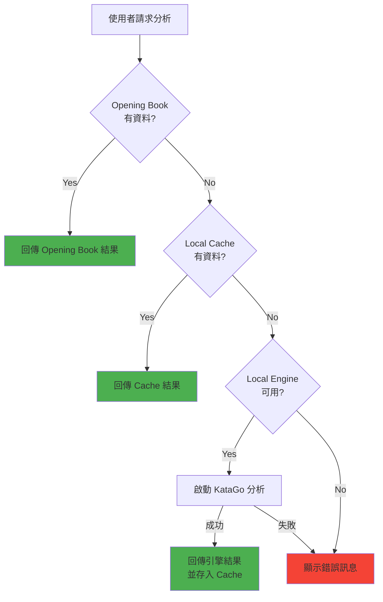
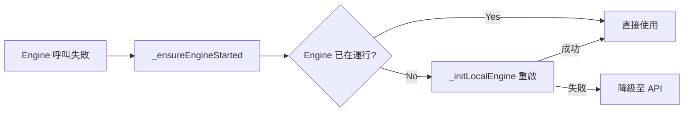
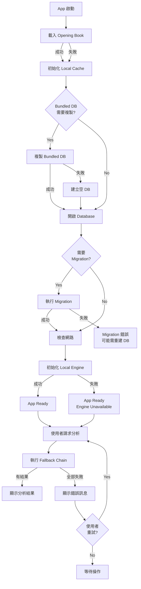

# Error Handling Specification

Version: 1.0.0 | Last Updated: 2026-02-12

本文件定義 Go Strategy App 全平台的錯誤處理策略、分類、Recovery 機制與使用者訊息規範。

---

## 1. 錯誤處理哲學 (Error Handling Philosophy)

### 核心原則

1. **Graceful Degradation（優雅降級）**: 任何單一元件的失敗不應導致整個 App 無法使用。分析功能依循 Fallback Chain，逐層降級直到找到可用資料來源。
2. **Offline-First（離線優先）**: App 預設在無網路環境下運作。離線不是錯誤狀態，而是正常的運作模式。
3. **Silent Recovery（靜默恢復）**: 系統層級的錯誤應自動恢復，僅在影響使用者操作時才顯示提示。
4. **Fail Fast at Boundaries（在邊界快速失敗）**: 使用者輸入與外部 API 請求應在入口點立即驗證並拒絕無效資料。

---

## 2. Fallback Chain（降級鏈）

App 的分析功能依循嚴格的優先順序，逐層嘗試：

```
Opening Book → Local Cache → Local KataGo Engine → Error Message
```

### 完整流程



### Source 標示

每個分析結果會標記 `AnalysisSource`，顯示資料來源：

| Source | 說明 | 圖示建議 |
|--------|------|----------|
| `openingBook` | 隨 App 附帶的預算資料 | Book icon |
| `localCache` | 本地 SQLite 快取 | Database icon |
| `localEngine` | 本地 KataGo 即時運算 | CPU icon |
| `none` | 無可用分析 | Warning icon |

---

## 3. 錯誤分類 (Error Categories)

### 3.1 Network Errors（網路錯誤）

> **注意**：App 採用純離線架構，不依賴遠端 API Server。網路錯誤僅影響雲端棋譜同步功能。

| 錯誤類型 | 觸發條件 | 處理方式 | 使用者影響 |
|----------|---------|---------|-----------|
| No Connection | 雲端同步時無網路 | 標記同步失敗，保留本地資料 | 低：分析功能不受影響 |
| OAuth Timeout | 登入流程超時 | 顯示錯誤，維持匿名模式 | 低：核心功能不需登入 |
| Cloud Storage Error | Google Drive / iCloud 存取失敗 | 記錄錯誤，保留本地棋譜 | 低：本地棋譜不受影響 |

### 3.2 Engine Errors（引擎錯誤）

| 錯誤類型 | 觸發條件 | 處理方式 | 使用者影響 |
|----------|---------|---------|-----------|
| KataGoStartupError | 執行檔不存在 / 權限不足 | 標記 `KataGoStatus.error`，降級至 API | 中：無法使用本地引擎 |
| KataGoProcessError | 引擎 process 非預期終止 | 自動嘗試重啟，失敗則降級 | 中：暫時無法分析 |
| KataGoCommandError | GTP 指令回傳錯誤 (`?` 開頭) | 記錄錯誤，回傳預設值 | 低：單次指令失敗 |
| GTP Timeout | 單一 GTP 指令超過 60 秒 | 拋出 `KataGoProcessError` | 中：需要重啟引擎 |
| Analysis Timeout | kata-analyze 超過 10 秒無足夠結果 | 使用已收集的部分結果，或 fallback 到 genmove | 低：結果品質可能較低 |
| Desktop Engine Start Timeout | 30 秒內未收到 ready 訊號 | 標記啟動失敗 | 中：降級至 API |

**Python 端例外層級** (`src/katago_gtp.py`):
```
KataGoError (base)
├── KataGoStartupError   # 啟動失敗
├── KataGoCommandError   # GTP 指令失敗
└── KataGoProcessError   # Process 層級錯誤
```

**Flutter 端狀態** (`mobile/lib/services/katago_service.dart`, `katago_desktop_service.dart`):
```
KataGoStatus / KataGoDesktopStatus:
  stopped → starting → running
                     → error
```

### 3.3 Data Errors（資料錯誤）

| 錯誤類型 | 觸發條件 | 處理方式 | 使用者影響 |
|----------|---------|---------|-----------|
| Corrupt Cache | `json.JSONDecodeError` 解析快取資料 | 回傳 `None`，視為 cache miss | 無：自動降級 |
| Missing Opening Book | `rootBundle.load()` 失敗 | `_openingBookLoaded = false`，跳過此層 | 低：仍有 Cache / Engine |
| Invalid Opening Book JSON | JSON decode 或 entry 解析失敗 | 跳過無效 entry，繼續載入其餘 | 無：部分資料仍可用 |
| DB Migration Failure | Schema migration 失敗 | `print` 警告，可能 raise（阻止啟動） | 高：需要清除 DB |
| Bundled DB Copy Failure | 複製 bundled DB 到本地失敗 | 建立空 DB 繼續 | 低：首次啟動無預載資料 |
| CacheMissError | 快取中無此局面 | 降級至本地引擎 | 低：引擎可即時運算 |

**實作位置**: `src/cache.py`, `mobile/lib/services/cache_service.dart`, `mobile/lib/services/opening_book_service.dart`

### 3.4 UI / Game Logic Errors（介面 / 遊戲邏輯錯誤）

| 錯誤類型 | 觸發條件 | 處理方式 | 使用者影響 |
|----------|---------|---------|-----------|
| Invalid Move (Occupied) | 嘗試在已有棋子的位置落子 | `placeStone()` 直接 return | 無：操作被靜默忽略 |
| Ko Violation | Ko hash 循環偵測 | 拒絕落子（含在 Hash 計算中） | 低：提示無效手 |
| Invalid GTP Format | Move 格式不符 `^[BW] [A-HJ-T][1-9][0-9]?$` | `ValueError` / HTTP 400 | 低：立即回報格式錯誤 |
| Invalid Board Size | 棋盤大小非 9/13/19 | `ValueError` / HTTP 400 | 低：立即回報 |
| Analysis In Progress | 分析進行中重複觸發 | `if (_isAnalyzing) return` | 無：靜默忽略 |
| Symmetry Transform Error | 座標轉換超出邊界 | 回傳原始座標 | 無：降級為不轉換 |

---

## 4. Retry Strategies（重試策略）

### 4.1 Engine Retry

**策略**: 自動嘗試重啟一次，失敗則降級。



**相關程式碼** (`mobile/lib/providers/game_provider.dart`):
```dart
Future<bool> _ensureEngineStarted() async {
  if (localEngineRunning) return true;
  await _initLocalEngine();
  return localEngineRunning;
}

Future<bool> restartEngine() async {
  // stop then start
  await _kataGoDesktop.stop();
  await _initLocalEngine();
  return localEngineRunning;
}
```

**Python 端** (`src/katago_gtp.py`):
```python
def _ensure_running(self):
    """Process died -> restart."""
    if self.process.poll() is not None:
        self._started = False
        self.start()
```

### 4.2 Cache Retry

**策略**: 不重試。Cache miss 直接降級至下一層。

**資料修復**:
- Corrupt JSON entry: 回傳 `None`（視為 miss），不刪除原始資料
- DB Schema 不符: 自動 migration（`_init_db` 中的多階段 migration）
- 空資料庫: 自動從 bundled asset 複製（`_copyBundledDbIfNeeded`）

---

## 5. Platform-Specific Error Handling（平台特定處理）

### 5.1 Desktop (macOS / Windows / Linux)

| 層級 | 錯誤類型 | 處理 |
|------|---------|------|
| Native | Process crash (KataGo subprocess) | `exitCode.then()` 偵測，標記 `error` 狀態 |
| Dart | `Process.start()` 失敗 | try/catch，標記 `KataGoDesktopStatus.error` |
| Dart | FFI Database init 失敗 | `initFfiDatabase()` 在 `CacheService.init()` 中呼叫 |
| Dart | Asset extraction 失敗 | `debugPrint` 警告，回傳目標路徑讓 service 自行處理 |

Desktop 使用 `KataGoDesktopService`（透過 `dart:io` `Process`），stderr 用於偵測啟動狀態：
```dart
// 偵測 KataGo ready 訊號
if (line.contains('Started, ready to begin handling requests') ||
    line.contains('All neural net inits done')) {
  _startCompleter!.complete(true);
}

// 偵測錯誤
if (line.startsWith('Error') || line.contains('FATAL') || line.contains('exception')) {
  _errorCallback?.call(line);
}
```

### 5.2 Mobile (Android / iOS)

| 層級 | 錯誤類型 | 處理 |
|------|---------|------|
| Native (JNI/FFI) | KataGo native library 載入失敗 | Platform Channel 回傳 `false` |
| Native | Native crash | Platform-specific crash reporting (未內建) |
| Dart | `MissingPluginException` | 引擎功能不可用，降級至 Cache + API |
| Dart | EventChannel stream error | `_status = KataGoStatus.error`，通知 callback |

Mobile 使用 `KataGoService`（透過 Platform Channel）：
```dart
static const _methodChannel = MethodChannel('com.gostratefy.go_strategy_app/katago');
static const _eventChannel = EventChannel('com.gostratefy.go_strategy_app/katago_events');
```

### 5.3 Web

```dart
// Web 平台停用本地 SQFlite
if (kIsWeb) {
  debugPrint('[CacheService] Web platform: Disabling local SQFlite cache');
  return;
}
```

Web 平台限制：
- 無本地 SQLite 支援（CacheService 回傳空結果）
- 無本地 KataGo 引擎
- 僅依賴 Opening Book（in-memory）

---

## 6. User-Facing Error Messages（使用者錯誤訊息規範）

### 訊息原則

1. **友善、具體**: 不顯示技術堆疊，使用使用者能理解的語言
2. **可操作**: 告訴使用者可以做什麼（而非只說出了什麼問題）
3. **標示來源**: 透過 `AnalysisSource` 讓使用者知道資料來自哪裡

### 訊息範例

| 情境 | 訊息 |
|------|------|
| 所有來源皆失敗 | `"Position not in opening book/cache; local engine disabled"` |
| 引擎錯誤 | `"Local engine error: {detail}"` / `"Desktop engine error: {detail}"` |
| 分析超時 | `"Analysis timed out"` |
| 分析取消 | `"Analysis cancelled"` |
| 引擎無法啟動 | `"local engine enabled but not running ({detail})"` |

### 錯誤訊息組合邏輯

`GameProvider.analyze()` 在所有來源都失敗後，會組合多段描述：

```dart
final parts = <String>['Position not in opening book/cache'];
if (_localEngineEnabled && !localEngineRunning) {
  parts.add('local engine enabled but not running');
}
_error = parts.join('; ');
```

---

## 7. Logging Standards（日誌規範）

### Flutter 端

使用 `debugPrint` 進行開發期日誌輸出，格式為 `[ServiceName] message`：

```dart
debugPrint('[CacheService] Initialized with 31590 entries');
debugPrint('[OpeningBook] Looking up: 9:7.5:B[E5] (1 moves)');
debugPrint('[GameProvider] Opening book returned 5 moves');
debugPrint('[KataGo STDOUT] ...');
debugPrint('[KataGo STDERR] ...');
```

### Python 端

目前使用 `print` 進行日誌輸出（伺服器模式）：

```python
print("Starting Go Strategy API...")
print(f"KataGo started. Cache has {count} entries.")
print(f"Migrating database to support multiple visit counts...")
print(f"Warning: Failed to seed/migrate database: {e}")
```

> **建議改進**：未來應改用 Python `logging` 模組，支援日誌層級篩選、檔案輸出與 structured logging。

### 日誌層級指引

| 層級 | 用途 | 範例 |
|------|------|------|
| Info | 正常啟動 / 狀態變更 | `"Opening book loaded: 31590 entries"` |
| Warning | 非致命性問題，系統可自動恢復 | `"No bundled DB found or copy failed"` |
| Error | 需要注意的問題 | `"KataGo process exited with code 1"` |
| Debug | 開發期追蹤資訊 | `"[OpeningBook] Sym3: 9:7.5:B[E5]"` |

---

## 8. Error Recovery Flowchart（完整錯誤恢復流程）



---

## 9. Error Monitoring（錯誤監控與告警）

### 目前狀態：無集中式錯誤監控

App 與 Backend 目前都沒有集中式的 crash reporting 或 error tracking。

### 建議整合方案

| 工具 | 平台 | 用途 |
|------|------|------|
| **Sentry** | Flutter + Python | 跨平台 crash reporting、performance monitoring |
| **Firebase Crashlytics** | Android / iOS | 原生 crash reporting，與 Firebase 整合 |
| **Flutter `FlutterError.onError`** | All | 攔截 Flutter framework 層級的未處理例外 |
| **Python `sys.excepthook`** | Backend | 攔截 Python 未處理例外 |

### 建議監控的關鍵指標

- KataGo 引擎啟動失敗率（by platform）
- Cache miss rate（Opening Book / SQLite）
- API 錯誤率與 P99 延遲
- App crash-free rate

---

## 相關文件

- [LOGIC.md](LOGIC.md) - 離線優先運算流程與快取機制
- [openapi.yaml](openapi.yaml) - API 規範（含 ErrorResponse schema）
- [ARCHITECTURE.md](ARCHITECTURE.md) - 系統架構總覽
- [PLATFORM_MATRIX.md](PLATFORM_MATRIX.md) - 平台差異矩陣
